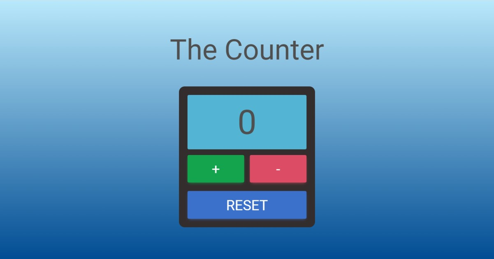

# The Counter

## Description

A simple counter suitable for any type of counting. In the repository you can find folders with HTML code and folders of assets, with CSS, JS, and images files. Very minimal graphics have been chosen, to give priority to practicality.

## Usage

    
To use the counter just connect to the website, no installation is required.  
It is very intuitive to use: to increase the count click on the `+` button, to decrease it instead click on the `-` button.  
The `RESET` button will reset the count to zero.
